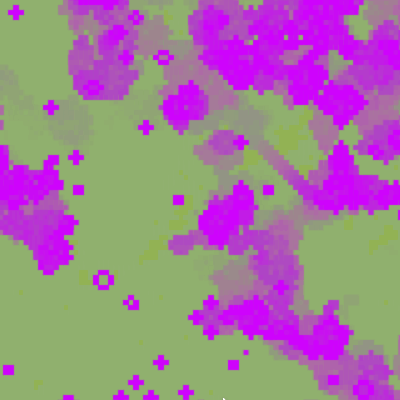
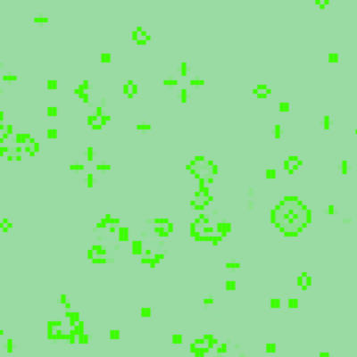

###


# Conway's Game Of Life

My JavaScript and Canvas version of the classic game.




 

Basic Rules of Life

- Any dead cell with exactly three live neighbours becomes a live cell, as if by reproduction

- Any live cell with fewer than two live neighbours dies, as if by underpopulation.

- Any live cell with more than three live neighbours dies, as if by overpopulation.

- Any live cell with two or three live neighbours lives on to the next generation.

## Run the example

Requires Node v12.18.3 or greater

```bash
$ yarn install
$ yarn start
```

open http://localhost:2020
